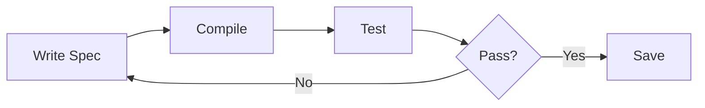

# Documentation Best Practices 2025

Expert skill for creating exceptional technical documentation based on modern best practices, tools, and frameworks in 2025.

## Overview

Great documentation is the bridge between your code and its users. In 2025, documentation has evolved beyond static text to become interactive, accessible, AI-friendly, and user-centric. This skill covers modern frameworks, content strategies, and automation techniques to create documentation that truly serves your users.

**Core principle:** Documentation should be discoverable, understandable, and actionable for all users across all devices.

## Modern Documentation Frameworks (2025)

### Top Frameworks

1. **Astro Starlight** (2023+, **RECOMMENDED**)
   - Built on Astro, extremely fast (near-zero JS by default)
   - Built-in search (Pagefind), i18n, accessibility (WCAG 2.2)
   - Component-based customization (Astro, React, Vue, Svelte)
   - Perfect for technical documentation
   - Excellent GitHub Pages integration
   ```bash
   npm create astro@latest -- --template starlight
   ```

2. **Docusaurus** (Meta, mature)
   - React-based, extensive ecosystem
   - Versioning built-in (great for API docs)
   - Blog + docs in one
   - Great plugin system
   - Best for large, complex projects
   ```bash
   npx create-docusaurus@latest my-docs classic
   ```

3. **VitePress** (Vue team)
   - Vue-powered, Vite-based (fast HMR)
   - Markdown-first with Vue components
   - Lightweight and performant
   ```bash
   npm create vitepress@latest
   ```

4. **Mintlify** (API-focused, commercial)
   - Beautiful out-of-box, MDX support
   - API playground integration
   - Analytics and feedback built-in
   ```bash
   npx @mintlify/cli init
   ```

5. **Nextra** (Vercel)
   - Next.js based
   - Code highlighting with Shiki
   - Search with FlexSearch
   ```bash
   npx create-next-app my-docs -e https://github.com/shuding/nextra-docs-template
   ```

### Framework Selection Guide

| Framework | Best For | Speed | Learning Curve | Ecosystem | GitHub Pages |
|-----------|----------|-------|----------------|-----------|--------------|
| Starlight | Technical docs, performance | ⚡⚡⚡ | Low | Growing | ✅ Excellent |
| Docusaurus | Large projects, versioning | ⚡⚡ | Medium | Mature | ✅ Good |
| VitePress | Vue users, fast dev | ⚡⚡⚡ | Low | Medium | ✅ Good |
| Mintlify | API docs, SaaS products | ⚡⚡ | Low | Commercial | ⚠️ Limited |
| Nextra | Next.js users | ⚡⚡ | Medium | Large | ✅ Good |

**Why Starlight in 2025?**
- **Performance:** Near-zero JavaScript (ships only what's needed)
- **Modern:** Built on Astro (island architecture)
- **Accessible:** WCAG 2.2 compliant out-of-the-box
- **Developer Experience:** File-based routing, hot reload, TypeScript support
- **Flexible:** Use any UI framework (React, Vue, Svelte) for custom components
- **Cost:** Free, no vendor lock-in

## Astro Starlight + GitHub Pages Setup Guide (RECOMMENDED)

### Why Starlight for GitHub Pages?

Astro Starlight is the ideal choice for GitHub Pages in 2025 because:
- **Official GitHub Pages support** via Astro Action
- **Free hosting** for every GitHub repository
- **Custom domain support** via CNAME
- **Lightning-fast performance** - near-zero JavaScript
- **Built-in accessibility** (WCAG 2.2 compliant)
- **Simple deployment** - one GitHub Actions workflow
- **Excellent DX** - file-based routing, instant HMR

### Complete Setup (2025)

#### 1. Initialize Starlight

```bash
# Create new Starlight site (interactive prompts)
npm create astro@latest -- --template starlight

# Or with specific package managers:
# pnpm create astro --template starlight
# yarn create astro --template starlight

cd my-docs

# Install dependencies (if not done automatically)
npm install

# Test locally
npm run dev  # Opens http://localhost:4321
```

The template creates a complete project structure with:
- Sample documentation pages
- Pre-configured search (Pagefind)
- Dark/light theme toggle
- Responsive navigation
- Accessibility features

#### 2. Configure for GitHub Pages

Edit `astro.config.mjs` with your GitHub repository details:

```javascript
import { defineConfig } from 'astro/config';
import starlight from '@astrojs/starlight';

export default defineConfig({
  // CRITICAL: GitHub Pages configuration
  site: 'https://yourusername.github.io',
  base: '/repository-name',  // Your repo name with leading slash

  // For username.github.io repos, use:
  // site: 'https://yourusername.github.io',
  // base: '/',  // Or omit base entirely

  integrations: [
    starlight({
      title: 'My Project Docs',
      description: 'Awesome documentation for my project',

      // Social links in header
      social: {
        github: 'https://github.com/yourusername/repository-name',
      },

      // Sidebar navigation
      sidebar: [
        {
          label: 'Getting Started',
          items: [
            { label: 'Introduction', link: '/intro/' },
            { label: 'Installation', link: '/getting-started/installation/' },
          ],
        },
        {
          label: 'Guides',
          autogenerate: { directory: 'guides' },  // Auto-generate from folder
        },
        {
          label: 'Reference',
          autogenerate: { directory: 'reference' },
        },
      ],

      // Enable edit links
      editLink: {
        baseUrl: 'https://github.com/yourusername/repository-name/edit/main/',
      },

      // Customize theme
      customCss: [
        './src/styles/custom.css',
      ],

      // Enable components
      components: {
        // Override default components if needed
        // Header: './src/components/Header.astro',
      },
    }),
  ],
});
```

**Key Configuration Notes:**

- **`site`**: Must be your full GitHub Pages URL
- **`base`**: Your repository name (e.g., `/my-docs`) - includes leading slash
- **Special case**: For `username.github.io` repositories, set `base: '/'` or omit it
- **`editLink`**: Enables "Edit this page" links on every page

#### 3. GitHub Actions Deployment (Recommended Method 2025)

Create `.github/workflows/deploy.yml`:

```yaml
name: Deploy to GitHub Pages

on:
  # Trigger on push to main branch
  push:
    branches: [ main ]
  # Allow manual trigger from Actions tab
  workflow_dispatch:

# Grant permissions for GitHub Pages deployment
permissions:
  contents: read
  pages: write
  id-token: write

# Allow only one concurrent deployment
concurrency:
  group: pages
  cancel-in-progress: false

jobs:
  build:
    runs-on: ubuntu-latest
    steps:
      - name: Checkout
        uses: actions/checkout@v4

      - name: Setup Node.js
        uses: actions/setup-node@v4
        with:
          node-version: 20

      - name: Install dependencies
        run: npm ci

      - name: Build with Astro
        run: npm run build

      - name: Upload Pages Artifact
        uses: actions/upload-pages-artifact@v3
        with:
          path: dist  # Astro builds to dist/ by default

  deploy:
    needs: build
    runs-on: ubuntu-latest
    environment:
      name: github-pages
      url: ${{ steps.deployment.outputs.page_url }}
    steps:
      - name: Deploy to GitHub Pages
        id: deployment
        uses: actions/deploy-pages@v4
```

**Simplified with Astro Action (Alternative):**

```yaml
name: Deploy to GitHub Pages

on:
  push:
    branches: [ main ]
  workflow_dispatch:

permissions:
  contents: read
  pages: write
  id-token: write

jobs:
  build:
    runs-on: ubuntu-latest
    steps:
      - uses: actions/checkout@v4
      - uses: withastro/action@v3  # Official Astro action (auto-detects everything!)

  deploy:
    needs: build
    runs-on: ubuntu-latest
    environment:
      name: github-pages
      url: ${{ steps.deployment.outputs.page_url }}
    steps:
      - uses: actions/deploy-pages@v4
```

**Enable GitHub Actions in your repository:**
1. Go to Settings → Pages
2. Under "Build and deployment" → "Source"
3. Select **GitHub Actions** (not "Deploy from a branch")
4. Push your code - deployment happens automatically!

#### 4. Test Locally Before Deploying

```bash
# Build the site
npm run build

# Preview the built site (exactly as it will appear on GitHub Pages)
npm run preview
```

Visit `http://localhost:4321/repository-name/` to verify:
- All links work with the `base` path
- Images and assets load correctly
- Navigation functions properly

**Important:** Always test with `npm run preview` (not just `npm run dev`) because the preview server respects your `base` configuration, while dev server doesn't always apply it.

#### 5. Custom Domain Setup (Optional)

If you have a custom domain:

1. **Add CNAME file:**
```bash
echo "docs.example.com" > public/CNAME
```

2. **Update astro.config.mjs:**
```javascript
export default defineConfig({
  site: 'https://docs.example.com',
  // Remove base or set to '/'
  integrations: [starlight({ /* ... */ })],
});
```

3. **Configure DNS:**
   - Add CNAME record: `docs.example.com` → `yourusername.github.io`

4. **Enable HTTPS in GitHub:**
   - Settings → Pages → Enforce HTTPS (automatic after DNS propagates)

### Starlight Themes & Customization

#### Built-in Theming

Starlight comes with beautiful themes out-of-the-box. Customize via:

**1. CSS Custom Properties (src/styles/custom.css):**

```css
:root {
  /* Accent color (used for links, buttons, highlights) */
  --sl-color-accent-low: #1e3a5f;
  --sl-color-accent: #3b82f6;
  --sl-color-accent-high: #60a5fa;

  /* Gray shades for text and backgrounds */
  --sl-color-gray-1: #f8fafc;
  --sl-color-gray-2: #f1f5f9;
  --sl-color-gray-3: #e2e8f0;
  --sl-color-gray-4: #cbd5e1;
  --sl-color-gray-5: #64748b;
  --sl-color-gray-6: #1e293b;

  /* Fonts */
  --sl-font: 'Inter', system-ui, sans-serif;
  --sl-font-mono: 'JetBrains Mono', 'Fira Code', monospace;

  /* Border radius */
  --sl-border-radius: 0.5rem;
}

/* Dark theme overrides */
:root[data-theme='dark'] {
  --sl-color-accent-low: #1e293b;
  --sl-color-accent: #60a5fa;
  --sl-color-accent-high: #93c5fd;
}
```

**2. Component Overrides:**

Starlight allows overriding built-in components:

```javascript
// astro.config.mjs
export default defineConfig({
  integrations: [
    starlight({
      components: {
        // Override the Header component
        Header: './src/components/CustomHeader.astro',
        // Override the Footer
        Footer: './src/components/CustomFooter.astro',
        // Add custom components
        PageFrame: './src/components/PageFrame.astro',
      },
    }),
  ],
});
```

**3. Custom Page Layout:**

```astro
---
// src/components/CustomHeader.astro
import type { Props } from '@astrojs/starlight/props';
import Default from '@astrojs/starlight/components/Header.astro';
---

<Default {...Astro.props}>
  <div>Custom content in header</div>
</Default>
```

#### Popular Starlight Plugins

```bash
# Link validation
npm install starlight-links-validator

# OpenAPI documentation
npm install starlight-openapi

# Blog integration
npm install starlight-blog

# Image optimization
npm install @astrojs/image

# Sitemap generation (built into Astro)
# Just add to integrations in astro.config.mjs
```

**Configure plugins in astro.config.mjs:**

```javascript
import { defineConfig } from 'astro/config';
import starlight from '@astrojs/starlight';
import starlightLinksValidator from 'starlight-links-validator';
import starlightOpenAPI from 'starlight-openapi';

export default defineConfig({
  integrations: [
    starlight({
      title: 'My Docs',
      plugins: [
        starlightLinksValidator(),
        starlightOpenAPI([
          {
            base: 'api',
            schema: './openapi.json',
          },
        ]),
      ],
    }),
  ],
});
```

### Advanced Features

#### Multi-Language Support (i18n)

Starlight has excellent built-in internationalization:

```javascript
// astro.config.mjs
export default defineConfig({
  integrations: [
    starlight({
      title: 'My Docs',
      defaultLocale: 'en',
      locales: {
        en: {
          label: 'English',
        },
        es: {
          label: 'Español',
        },
        fr: {
          label: 'Français',
        },
        ja: {
          label: '日本語',
          lang: 'ja',  // Override for HTML lang attribute
        },
      },
    }),
  ],
});
```

**File structure for i18n:**
```
src/content/docs/
├── en/
│   ├── index.md
│   └── guides/
│       └── getting-started.md
├── es/
│   ├── index.md
│   └── guides/
│       └── getting-started.md
└── fr/
    ├── index.md
    └── guides/
        └── getting-started.md
```

**Language picker:** Automatically added to the header

#### Sidebar Configuration

Starlight offers flexible sidebar options:

```javascript
sidebar: [
  // Single link
  { label: 'Home', link: '/' },

  // Group with manual items
  {
    label: 'Getting Started',
    items: [
      { label: 'Installation', link: '/getting-started/install/' },
      { label: 'Configuration', link: '/getting-started/config/' },
    ],
  },

  // Auto-generated from directory
  {
    label: 'Guides',
    autogenerate: { directory: 'guides' },
  },

  // Collapsed by default
  {
    label: 'API Reference',
    collapsed: true,
    autogenerate: { directory: 'api' },
  },

  // External link
  { label: 'GitHub', link: 'https://github.com/user/repo', badge: 'new' },

  // With custom badge
  {
    label: 'Advanced',
    badge: { text: 'Beta', variant: 'caution' },
    items: [
      { label: 'Experimental Features', link: '/advanced/experimental/' },
    ],
  },
],
```

#### Built-in Components

Starlight includes powerful MDX components:

**Tabs:**
```mdx
import { Tabs, TabItem } from '@astrojs/starlight/components';

<Tabs>
  <TabItem label="npm">
    ```bash
    npm install vibesafe
    ```
  </TabItem>
  <TabItem label="pnpm">
    ```bash
    pnpm add vibesafe
    ```
  </TabItem>
  <TabItem label="yarn">
    ```bash
    yarn add vibesafe
    ```
  </TabItem>
</Tabs>
```

**Cards:**
```mdx
import { Card, CardGrid } from '@astrojs/starlight/components';

<CardGrid>
  <Card title="Quick Start" icon="rocket">
    Get up and running in 5 minutes.
  </Card>
  <Card title="Guides" icon="open-book">
    Learn how to use advanced features.
  </Card>
</CardGrid>
```

**Asides (Callouts):**
```mdx
:::note
This is a helpful note for readers.
:::

:::tip
Pro tip: Use `npm run preview` to test before deploying!
:::

:::caution
Warning: This action cannot be undone.
:::

:::danger
Danger: This will delete all your data!
:::
```

**File Tree:**
```mdx
import { FileTree } from '@astrojs/starlight/components';

<FileTree>
- src/
  - content/
    - docs/
      - index.md
      - guides/
        - getting-started.md
  - components/
  - styles/
- astro.config.mjs
- package.json
</FileTree>
```

### Troubleshooting Common Issues

#### Issue: Blank page after deployment

**Solutions:**
1. Check `base` matches your repository name: `/repo-name/`
2. Verify `site` is your correct GitHub Pages URL
3. Check browser console for 404 errors on assets
4. Ensure GitHub Pages source is set to "GitHub Actions"
5. Test with `npm run preview` locally first

#### Issue: Assets (CSS/JS/images) not loading

**Problem:** 404 errors for `/_astro/` or `/assets/` files

**Solutions:**
1. Verify `base` in config matches deployment path
2. Check that `site` includes full URL with protocol
3. Update all hardcoded absolute paths to use `base`
4. Clear GitHub Pages cache (disable/re-enable in settings)
5. Ensure build completed successfully (check Actions tab)

#### Issue: Build fails in GitHub Actions

**Solutions:**
1. Check Node.js version matches locally (20+ recommended)
2. Verify all dependencies are in `package.json`
3. Look at Actions logs for specific error messages
4. Test build locally: `npm run build`
5. Check for TypeScript errors if using `.ts` files

#### Issue: Site shows 404 even after successful deployment

**Solutions:**
1. Wait 2-5 minutes for GitHub Pages CDN to update
2. Verify repository is public (or GitHub Pro for private)
3. Check Pages settings: Settings → Pages → Source = GitHub Actions
4. Ensure workflow has proper permissions (pages: write, id-token: write)
5. Try accessing with `/` at end: `https://user.github.io/repo/`

#### Issue: Links broken after deployment

**Problem:** Internal links don't work with `base` path

**Solutions:**
1. Use relative links: `[Guide](../guides/intro)` not `/guides/intro`
2. Or use Astro's URL helpers in components
3. Test with `npm run preview` which respects `base`
4. Check sidebar links include proper paths

### Performance Tips

```javascript
// astro.config.mjs
export default defineConfig({
  // Enable compression
  compressHTML: true,

  // Vite optimizations
  vite: {
    build: {
      cssMinify: 'lightningcss',
      rollupOptions: {
        output: {
          manualChunks: {
            // Split vendor code
            'vendor': ['react', 'react-dom'],
          },
        },
      },
    },
  },

  // Image optimization
  image: {
    service: {
      entrypoint: 'astro/assets/services/sharp',
    },
  },

  integrations: [
    starlight({
      // Disable unused features
      pagefind: true,  // Keep search
      favicon: '/favicon.svg',
    }),
  ],
});
```

**Additional optimizations:**
```bash
# Install sharp for faster image processing
npm install sharp

# Use WebP/AVIF images
npm install @astrojs/image
```

### Recommended Project Structure

```
my-starlight-site/
├── .github/
│   └── workflows/
│       └── deploy.yml          # GitHub Actions workflow
├── src/
│   ├── content/
│   │   ├── docs/
│   │   │   ├── index.mdx       # Docs homepage
│   │   │   ├── intro.md        # Introduction
│   │   │   ├── guides/         # How-to guides
│   │   │   │   ├── getting-started.md
│   │   │   │   └── configuration.md
│   │   │   ├── reference/      # API reference
│   │   │   │   └── api.md
│   │   │   └── tutorials/      # Step-by-step tutorials
│   │   │       └── first-app.md
│   │   └── config.ts           # Content collection config
│   ├── components/             # Custom Astro/React/Vue components
│   │   ├── CustomHeader.astro
│   │   └── ApiEndpoint.astro
│   ├── styles/
│   │   └── custom.css          # Theme customization
│   └── assets/
│       └── images/             # Optimized images
├── public/
│   ├── CNAME                   # Custom domain (optional)
│   ├── favicon.svg
│   └── social-card.png         # OpenGraph image
├── astro.config.mjs            # Main Astro configuration
├── tsconfig.json               # TypeScript configuration
└── package.json
```

**Key differences from other frameworks:**
- Content lives in `src/content/docs/` (not root `docs/`)
- Build output goes to `dist/` (not `build/`)
- No separate sidebar file - configured in `astro.config.mjs`
- Can mix `.md`, `.mdx`, and `.astro` files

### Complete Workflow Example

```bash
# 1. Create new Starlight site
npm create astro@latest my-docs -- --template starlight
cd my-docs

# 2. Update astro.config.mjs with your GitHub details
# Set site and base values

# 3. Create GitHub Actions workflow
mkdir -p .github/workflows
cat > .github/workflows/deploy.yml <<'EOF'
name: Deploy to GitHub Pages
on:
  push:
    branches: [ main ]
  workflow_dispatch:
permissions:
  contents: read
  pages: write
  id-token: write
jobs:
  build:
    runs-on: ubuntu-latest
    steps:
      - uses: actions/checkout@v4
      - uses: withastro/action@v3
  deploy:
    needs: build
    runs-on: ubuntu-latest
    environment:
      name: github-pages
      url: ${{ steps.deployment.outputs.page_url }}
    steps:
      - uses: actions/deploy-pages@v4
EOF

# 4. Test locally
npm run dev  # http://localhost:4321
npm run build && npm run preview  # Test with base path

# 5. Initialize git and push
git init
git add .
git commit -m "Initial Starlight setup"
git branch -M main
git remote add origin https://github.com/yourusername/my-docs.git
git push -u origin main

# 6. Enable GitHub Pages in Settings → Pages → Source: GitHub Actions

# 7. Wait for deployment (check Actions tab), then visit:
# https://yourusername.github.io/my-docs/
```

**Verify deployment:**
```bash
# Check workflow status
gh run list  # If you have GitHub CLI

# Or visit: https://github.com/yourusername/my-docs/actions
```

## Alternative: Docusaurus + GitHub Pages Setup

**When to use Docusaurus instead of Starlight:**
- You need built-in versioning for API documentation (v1, v2, etc.)
- You want blog + docs in one site
- Your team is already invested in React ecosystem
- You need extensive plugin ecosystem
- You're building for a large organization with complex requirements

### Quick Setup

```bash
# 1. Create site
npx create-docusaurus@latest my-docs classic
cd my-docs

# 2. Add .nojekyll (REQUIRED for GitHub Pages)
touch static/.nojekyll

# 3. Configure for GitHub Pages
# Edit docusaurus.config.js:
# - url: 'https://yourusername.github.io'
# - baseUrl: '/repository-name/'
# - organizationName: 'yourusername'
# - projectName: 'repository-name'

# 4. Create GitHub Actions workflow
# Use similar workflow to Starlight but:
# - Build output is in 'build/' not 'dist/'
# - May need additional configuration

# 5. Deploy
git init && git add . && git commit -m "Initial commit"
git remote add origin https://github.com/yourusername/my-docs.git
git push -u origin main
```

For detailed Docusaurus setup, see the [official documentation](https://docusaurus.io/docs/deployment#deploying-to-github-pages).

**Key differences from Starlight:**
- Requires `.nojekyll` file in `static/` directory
- More configuration options (can be overwhelming)
- Heavier JavaScript bundle (React + more features)
- Separate `sidebars.js` configuration file
- Blog features built-in

## Documentation Structure (Diátaxis Framework)

Modern documentation follows the **Diátaxis** framework (2021+, industry standard):

### 1. Tutorials (Learning-Oriented)
**Purpose:** Guide beginners through a complete example
**Characteristics:**
- Step-by-step instructions
- Concrete, achievable goal
- No explanation (just do)
- Beginner-safe

**Example structure:**
```markdown
# Build Your First API with FastAPI

## What You'll Build
A REST API that manages a todo list.

## Prerequisites
- Python 3.12+
- 15 minutes

## Step 1: Installation
```bash
pip install fastapi uvicorn
```

## Step 2: Create main.py
... (concrete code)

## Step 3: Run the server
```bash
uvicorn main:app --reload
```

## Next Steps
- Try the How-To guide for authentication
- Read the API Reference
```

### 2. How-To Guides (Task-Oriented)
**Purpose:** Show how to solve specific problems
**Characteristics:**
- Assume some knowledge
- Focus on goals, not learning
- Flexible, adaptable
- Real-world scenarios

**Example structure:**
```markdown
# How to Add Authentication

## Overview
This guide shows how to add JWT authentication to your API.

## Prerequisites
- Existing FastAPI application
- Understanding of HTTP basics

## Steps

### 1. Install dependencies
```bash
pip install python-jose[cryptography] passlib[bcrypt]
```

### 2. Create security utilities
... (focused code snippets)

### 3. Protect endpoints
... (specific examples)

## Troubleshooting
- **Token expired**: Adjust `ACCESS_TOKEN_EXPIRE_MINUTES`
- **Invalid credentials**: Check password hashing

## Related
- [Tutorial: Build Your First API](#)
- [Reference: Security API](#)
```

### 3. Reference (Information-Oriented)
**Purpose:** Describe the machinery (API, CLI, configuration)
**Characteristics:**
- Dry, precise, complete
- Alphabetical or logical order
- No explanation (just facts)
- Auto-generated when possible

**Example structure:**
```markdown
# API Reference

## Functions

### `vibesafe.func`
Decorator for pure function specifications.

**Signature:**
```python
def func(
    provider: str = "default",
    template: str = "prompts/function.j2"
) -> Callable
```

**Parameters:**
- `provider` (str): Provider name from config. Default: "default"
- `template` (str): Path to Jinja2 template. Default: "prompts/function.j2"

**Returns:**
- Callable: Decorated function that loads generated implementation

**Raises:**
- `VibesafeNotCompiled`: Function not compiled yet
- `VibesafeHashMismatch`: Checkpoint hash mismatch (prod mode)

**Example:**
```python
@vibesafe.func
def add(a: int, b: int) -> int:
    """Add two numbers."""
    yield VibesafeHandled()
```

**See Also:**
- [vibesafe.http](#vibesafe-http)
- [How-To: Write Your First Spec](#)
```

### 4. Explanation (Understanding-Oriented)
**Purpose:** Clarify and illuminate concepts
**Characteristics:**
- Background, context, alternatives
- Why, not how
- Multiple perspectives
- Connects topics

**Example structure:**
```markdown
# Understanding Hash-Locked Checkpoints

## The Problem
How do we ensure AI-generated code hasn't changed unexpectedly?

## The Solution
Vibesafe uses cryptographic hashing to lock specifications to implementations.

## How It Works

### Spec Hashing
When you write a spec, vibesafe computes a deterministic hash from:
- Function signature
- Docstring (including doctests)
- Pre-VibesafeHandled code
- Template, provider, model settings

### Checkpoint Hashing
The generated implementation is hashed together with:
- Spec hash
- Prompt hash
- Generated code

### Verification
Every time you load a function, vibesafe checks:
1. Does the checkpoint exist?
2. Does the spec hash match?
3. Does the checkpoint hash match?

## Why This Matters
- **Reproducibility**: Same spec = same code
- **Integrity**: Detects tampering
- **Confidence**: Safe for production

## Trade-offs
- **Strictness**: Any spec change invalidates checkpoint
- **Storage**: Checkpoints accumulate over time

## Alternatives Considered
- File modification time (unreliable)
- Manual version tags (error-prone)
- No verification (dangerous)

## Related Concepts
- [Content-addressed storage](#)
- [Merkle trees](#)
```

## Content Best Practices

### Writing Style

✅ **DO:**
- Use active voice: "Run the command" not "The command should be run"
- Use present tense: "The function returns" not "The function will return"
- Use "you" for the reader: "You can configure" not "One can configure"
- Be concise: "Remove" not "In order to remove"
- Use examples liberally
- Define acronyms on first use
- Use consistent terminology

❌ **DON'T:**
- Use jargon without explanation
- Write walls of text (break into sections)
- Assume reader's context
- Use marketing speak in technical docs
- Say "simply" or "just" (it's condescending)
- Mix tutorials with reference material

### Code Examples

**Best practices:**
1. **Runnable code**: Every example should actually work
2. **Minimal examples**: Remove unnecessary code
3. **Full context**: Include imports, setup
4. **Output shown**: Show expected results
5. **Copy-friendly**: Use proper code blocks

**Good example:**
```python
# Complete, runnable example
from vibesafe import vibesafe, VibesafeHandled

@vibesafe.func
def greet(name: str) -> str:
    """
    Return a greeting message.

    >>> greet("Alice")
    'Hello, Alice!'
    """
    yield VibesafeHandled()

# Run it
print(greet("Alice"))
# Output: Hello, Alice!
```

**Bad example:**
```python
# Incomplete, won't run
@vibesafe.func
def greet(name):  # Missing type hints
    # Missing docstring
    # Missing implementation
```

### Visual Elements

1. **Diagrams** (Use Mermaid in Markdown)
```markdown

```

2. **Tables** (For comparisons)
```markdown
| Feature | vibesafe | Traditional |
|---------|----------|-------------|
| Spec-first | ✅ | ❌ |
| Verified | ✅ | ❌ |
| AI-powered | ✅ | ❌ |
```

3. **Callouts** (For important info)
```markdown
> **Note:** This feature requires Python 3.12+

> **Warning:** This will delete all cached data

> **Tip:** Use `--force` to recompile
```

## Accessibility (WCAG 2.2 Compliance)

### Essential Requirements

1. **Semantic HTML**
   - Use proper heading hierarchy (h1 → h2 → h3)
   - Use `<nav>`, `<main>`, `<aside>` elements
   - Use `<code>` for inline code, `<pre>` for blocks

2. **Alt Text**
   - All images must have descriptive alt text
   - Decorative images: `alt=""`
   - Diagrams: Provide text alternative

3. **Keyboard Navigation**
   - All interactive elements reachable by Tab
   - Skip-to-content link
   - Focus indicators visible

4. **Color Contrast**
   - Text: minimum 4.5:1 contrast ratio
   - Large text (18pt+): minimum 3:1
   - Use tools like WebAIM Contrast Checker

5. **Screen Reader Support**
   - Test with NVDA (Windows), VoiceOver (Mac)
   - Use ARIA labels for complex widgets
   - Provide text transcripts for videos

### Accessible Code Examples

```markdown
<!-- Good: Proper labeling -->
<div role="region" aria-label="Code example: Basic usage">
```python
from vibesafe import vibesafe
```
</div>

<!-- Good: Alt text for diagrams -->

```

## Search Optimization

### Built-in Search

Most frameworks include search (Algolia DocSearch, Pagefind, etc.)

**Enable in Starlight:**
```javascript
// astro.config.mjs
export default defineConfig({
  integrations: [
    starlight({
      title: 'My Docs',
      plugins: [starlightLinksValidator()],
      // Built-in Pagefind search (free)
    }),
  ],
});
```

### SEO Best Practices

1. **Meta tags**
```markdown
---
title: Getting Started with Vibesafe
description: Learn how to install and use vibesafe for AI-powered code generation
---
```

2. **OpenGraph tags** (for social sharing)
```html
<meta property="og:title" content="Vibesafe Documentation" />
<meta property="og:description" content="AI-powered, verifiable code generation" />
<meta property="og:image" content="/social-card.png" />
```

3. **Structured data** (JSON-LD)
```html
<script type="application/ld+json">
{
  "@context": "https://schema.org",
  "@type": "SoftwareApplication",
  "name": "Vibesafe",
  "description": "AI-powered code generation with hash-locked specs"
}
</script>
```

## API Documentation

### OpenAPI/Swagger (REST APIs)

**Generate from code (FastAPI):**
```python
from fastapi import FastAPI

app = FastAPI(
    title="My API",
    description="A great API",
    version="1.0.0",
    docs_url="/docs",        # Swagger UI
    redoc_url="/redoc",      # ReDoc
    openapi_url="/openapi.json"
)

@app.get("/items/{item_id}")
async def read_item(item_id: int):
    """Get an item by ID."""
    return {"item_id": item_id}
```

**Integrate with docs (Starlight + Scalar):**
```markdown
---
title: API Reference
---

import { ApiReference } from '@scalar/api-reference';

<ApiReference
  url="/openapi.json"
  theme="purple"
/>
```

### AsyncAPI (Event-Driven APIs)

```yaml
asyncapi: 3.0.0
info:
  title: Event Bus API
  version: 1.0.0

channels:
  user.signup:
    description: User signup events
    messages:
      UserSignedUp:
        payload:
          type: object
          properties:
            userId: { type: string }
            email: { type: string }
```

## Automation & Tooling

### Docs-as-Code Workflow

```yaml
# .github/workflows/docs.yml
name: Deploy Docs

on:
  push:
    branches: [main]
    paths:
      - 'docs/**'
      - 'src/**/*.py'  # Rebuild if code changes (for API docs)

jobs:
  deploy:
    runs-on: ubuntu-latest
    steps:
      - uses: actions/checkout@v3

      - name: Setup Node
        uses: actions/setup-node@v3
        with:
          node-version: 20

      - name: Generate API docs
        run: |
          pip install sphinx sphinx-autodoc-typehints
          sphinx-apidoc -o docs/api src/

      - name: Build docs
        run: |
          npm install
          npm run docs:build

      - name: Deploy to GitHub Pages
        uses: peaceiris/actions-gh-pages@v3
        with:
          github_token: ${{ secrets.GITHUB_TOKEN }}
          publish_dir: ./docs/.vitepress/dist
```

### Auto-Generated API Docs (Python)

**Using Sphinx with autodoc:**
```bash
# Install
pip install sphinx sphinx-autodoc-typehints sphinx-rtd-theme

# Generate
sphinx-quickstart docs
sphinx-apidoc -o docs/api src/

# Build
sphinx-build -b html docs docs/_build
```

**Using MkDocs with mkdocstrings:**
```yaml
# mkdocs.yml
site_name: My Docs
theme:
  name: material
  features:
    - navigation.instant
    - search.suggest
    - content.code.copy

plugins:
  - search
  - mkdocstrings:
      handlers:
        python:
          options:
            show_source: true
            show_root_heading: true
```

```markdown
# API Reference

::: vibesafe.core.VibesafeDecorator
    options:
      show_source: true
      members:
        - func
        - http
```

### Link Checking

**Using Starlight plugin:**
```javascript
// astro.config.mjs
import { defineConfig } from 'astro/config';
import starlight from '@astrojs/starlight';
import starlightLinksValidator from 'starlight-links-validator';

export default defineConfig({
  integrations: [
    starlight({
      plugins: [starlightLinksValidator()],
    }),
  ],
});
```

**Using dedicated tool:**
```bash
# Install
npm install -g broken-link-checker

# Check
blc http://localhost:3000 -ro
```

## Versioning

### Document Multiple Versions

**Docusaurus approach:**
```bash
# Create version
npm run docusaurus docs:version 1.0

# Structure
docs/              # Current (unreleased)
versioned_docs/
  version-1.0/     # Released
  version-0.9/
```

**Version selector UI:**
```javascript
// docusaurus.config.js
module.exports = {
  themeConfig: {
    navbar: {
      items: [
        {
          type: 'docsVersionDropdown',
          position: 'left',
        },
      ],
    },
  },
};
```

### Migration Guides

**Always provide when making breaking changes:**
```markdown
# Migration Guide: v1 to v2

## Breaking Changes

### Removed `vibesafe.generate()`
**Before:**
```python
result = vibesafe.generate(spec)
```

**After:**
```python
# Use compile + test + save workflow
vibesafe compile --target module/func
vibesafe test --target module/func
vibesafe save --target module/func
```

### Changed Configuration Format
**Before:**
```toml
[llm]
provider = "openai"
```

**After:**
```toml
[provider.default]
kind = "openai-compatible"
```

## Automated Migration
We provide a migration script:
```bash
python -m vibesafe.migrate v1-to-v2
```
```

## Interactive Elements

### Code Playgrounds

**Using Sandpack (React):**
```jsx
import { Sandpack } from "@codesandbox/sandpack-react";

<Sandpack
  template="python"
  files={{
    "/main.py": `
from vibesafe import vibesafe, VibesafeHandled

@vibesafe.func
def add(a: int, b: int) -> int:
    """Add two numbers."""
    yield VibesafeHandled()

print(add(2, 3))
    `,
  }}
/>
```

### Try-it-Now API Requests

**Using Scalar API Reference:**
```markdown
<ApiReference
  url="/openapi.json"
  tryItButton={true}
/>
```

## Analytics & Feedback

### Track What Users Read

**Plausible Analytics (privacy-friendly):**
```html
<script defer data-domain="docs.example.com" src="https://plausible.io/js/script.js"></script>
```

**Google Analytics 4:**
```javascript
// gtag.config.js
export const GA_TRACKING_ID = 'G-XXXXXXXXXX';
```

### Collect Feedback

**Simple feedback widget:**
```markdown
## Was this helpful?

<FeedbackWidget pageId="getting-started" />
```

**Implementation:**
```tsx
// components/FeedbackWidget.tsx
export function FeedbackWidget({ pageId }) {
  const [feedback, setFeedback] = useState(null);

  return (
    <div>
      <button onClick={() => vote('yes')}>👍 Yes</button>
      <button onClick={() => vote('no')}>👎 No</button>
      {feedback === 'no' && (
        <textarea placeholder="What can we improve?" />
      )}
    </div>
  );
}
```

## AI-Friendly Documentation

### Structure for LLM Consumption

1. **Clear headings**: Use semantic hierarchy
2. **Self-contained sections**: Each section stands alone
3. **Examples first**: Show before explaining
4. **Consistent patterns**: Same structure across pages
5. **Metadata**: Frontmatter with title, description, tags

**Example:**
```markdown
---
title: Authentication Guide
description: How to implement JWT authentication in your API
tags: [authentication, security, jwt, api]
difficulty: intermediate
time: 20 minutes
---

# How to Add JWT Authentication

## Quick Example
```python
# Complete working code here
```

## Explanation
[Detailed explanation]

## Step-by-Step
[Tutorial steps]
```

### Embeddings-Friendly

**Add searchable summaries:**
```markdown
---
summary: |
  This guide covers JWT authentication implementation including
  token generation, validation, and middleware integration.
  Prerequisites: FastAPI, basic HTTP knowledge.
  Time: 20 minutes.
---
```

## Mobile-First Design

### Responsive Breakpoints

Most frameworks handle this automatically, but ensure:
- Navigation collapses to hamburger menu on mobile
- Code blocks scroll horizontally (don't break)
- Tables convert to cards or scroll
- Images resize appropriately

### Test on Real Devices

```bash
# Use BrowserStack, LambdaTest, or local testing
# iOS Safari, Android Chrome, various screen sizes
```

## Internationalization (i18n)

### Starlight Example

```javascript
// astro.config.mjs
export default defineConfig({
  integrations: [
    starlight({
      title: 'My Docs',
      defaultLocale: 'en',
      locales: {
        en: { label: 'English' },
        es: { label: 'Español' },
        ja: { label: '日本語' },
      },
    }),
  ],
});
```

**Directory structure:**
```
src/content/docs/
  en/
    index.md
    getting-started.md
  es/
    index.md
    getting-started.md
```

## Community Contribution

### Make Docs Editable

**Add "Edit this page" links:**
```markdown
---
editUrl: https://github.com/user/repo/edit/main/docs/{file}
---
```

**Contribution guidelines:**
```markdown
# Contributing to Docs

## Quick Edits
Click "Edit this page" and submit a PR directly on GitHub.

## Local Development
1. Fork the repo
2. Clone: `git clone https://github.com/you/repo`
3. Install: `npm install`
4. Run: `npm run docs:dev`
5. Edit in `docs/`
6. Preview at `localhost:3000`
7. Submit PR

## Style Guide
- Use present tense
- Include runnable examples
- Test all code snippets
- Run `npm run docs:check` before submitting
```

## Performance Best Practices

### Optimize for Speed

1. **Minimize JavaScript**
   - Starlight/Astro: Near-zero JS by default
   - Code splitting: Load only what's needed
   - Lazy load images: `loading="lazy"`

2. **Optimize Images**
   ```bash
   # Use WebP/AVIF formats
   # Tools: squoosh, sharp, imagemin
   npm install sharp
   ```

3. **Enable CDN**
   - Vercel, Netlify, Cloudflare Pages (free tiers)
   - Automatic edge caching

4. **Measure Performance**
   ```bash
   # Lighthouse CI
   npm install -g @lhci/cli
   lhci autorun --config=lighthouserc.js
   ```

### Target Metrics (2025)

- **First Contentful Paint (FCP):** < 1.0s
- **Largest Contentful Paint (LCP):** < 2.5s
- **Cumulative Layout Shift (CLS):** < 0.1
- **Time to Interactive (TTI):** < 3.0s

## Examples of Excellent Documentation (2025)

### Hall of Fame

1. **Stripe** (https://stripe.com/docs)
   - Clear navigation, API reference with examples
   - Interactive code snippets
   - Excellent search

2. **Astro** (https://docs.astro.build)
   - Built with Starlight (dogfooding)
   - Great tutorials, clear structure
   - Multilingual

3. **Supabase** (https://supabase.com/docs)
   - Auto-generated from OpenAPI
   - Try-it-now API explorer
   - Client library examples in multiple languages

4. **Rust** (https://doc.rust-lang.org/book/)
   - The Rust Book: Tutorial + deep dive
   - Clear progression from beginner to advanced
   - Embedded playground

5. **Tailwind CSS** (https://tailwindcss.com/docs)
   - Search-first navigation
   - Live examples
   - Component showcase

## Documentation Checklist

### Before Launch

- [ ] All four doc types present (Tutorial, How-To, Reference, Explanation)
- [ ] Code examples tested and runnable
- [ ] Links validated (no 404s)
- [ ] Accessibility tested (WCAG 2.2 AA)
- [ ] Search enabled and tested
- [ ] Mobile responsive
- [ ] SEO meta tags added
- [ ] Analytics configured
- [ ] Feedback mechanism present
- [ ] "Edit this page" links work
- [ ] Performance targets met (Lighthouse score 90+)
- [ ] Versioning strategy defined
- [ ] API docs auto-generated (if applicable)
- [ ] CI/CD pipeline for docs
- [ ] 404 page customized
- [ ] Favicons and social cards added

## Quick Start Templates

### Starlight ⭐ (RECOMMENDED)

**Best for:** Technical docs, API references, developer documentation, performance-critical sites

```bash
# Create project
npm create astro@latest my-docs -- --template starlight
cd my-docs

# Start dev server (with HMR)
npm run dev  # → http://localhost:4321

# Build for production
npm run build

# Preview production build
npm run preview
```

**File structure:**
```
my-docs/
├── astro.config.mjs           # Main configuration
├── src/
│   ├── content/
│   │   ├── docs/
│   │   │   ├── index.md       # Homepage
│   │   │   ├── guides/        # Auto-generated sidebar
│   │   │   │   ├── getting-started.md
│   │   │   │   └── advanced.md
│   │   │   └── reference/     # API docs
│   │   │       └── api.md
│   │   └── config.ts          # Content collections config
│   ├── components/            # Custom components
│   └── styles/
│       └── custom.css         # Theme overrides
├── public/
│   ├── favicon.svg
│   └── CNAME                  # Custom domain (optional)
└── package.json
```

**Why Starlight:**
- ⚡ Near-zero JavaScript (fastest possible)
- ♿ WCAG 2.2 accessible out-of-the-box
- 🔍 Built-in search (Pagefind, no external service needed)
- 🌍 i18n built-in
- 🎨 Beautiful defaults, easy to customize
- 📱 Mobile-first responsive
- 🚀 Excellent GitHub Pages integration

### Docusaurus (For Large Organizations)

**Best for:** Large projects with versioning needs, React ecosystems, blog + docs combo

```bash
# Create project
npx create-docusaurus@latest my-docs classic
cd my-docs

# Start dev server
npm start  # → http://localhost:3000

# Build for production
npm run build

# Serve production build
npm run serve
```

**File structure:**
```
my-docs/
├── docusaurus.config.js       # Main configuration
├── sidebars.js                # Separate sidebar config
├── docs/
│   ├── intro.md
│   └── tutorial/
│       └── basics.md
├── blog/                      # Built-in blog
│   └── 2025-01-01-post.md
├── src/
│   ├── pages/                 # Custom React pages
│   │   └── index.js
│   └── css/
│       └── custom.css
└── static/
    ├── .nojekyll              # REQUIRED for GitHub Pages
    └── img/
```

**Why Docusaurus:**
- 📦 Mature ecosystem with many plugins
- 📝 Built-in blog functionality
- 🏷️ Excellent versioning for API docs
- ⚛️ React-based (if you love React)
- 🔧 Highly customizable via swizzling

## Advanced Techniques

### Custom Components

**Astro component for API endpoint:**
```astro
---
// components/ApiEndpoint.astro
const { method, path, description } = Astro.props;
---

<div class="api-endpoint">
  <span class="method method-{method.toLowerCase()}">{method}</span>
  <code class="path">{path}</code>
  <p>{description}</p>
</div>

<style>
  .method-get { background: #61affe; }
  .method-post { background: #49cc90; }
  .method-delete { background: #f93e3e; }
</style>
```

**Usage:**
```markdown
---
title: API Reference
---

import ApiEndpoint from '../../components/ApiEndpoint.astro';

<ApiEndpoint
  method="GET"
  path="/api/users/{id}"
  description="Retrieve a user by ID"
/>
```

### Dynamic Content from Code

**Extract docstrings automatically:**
```python
# scripts/extract_docs.py
import ast
import json

def extract_function_docs(filepath):
    with open(filepath) as f:
        tree = ast.parse(f.read())

    docs = []
    for node in ast.walk(tree):
        if isinstance(node, ast.FunctionDef):
            docs.append({
                'name': node.name,
                'docstring': ast.get_docstring(node),
                'args': [arg.arg for arg in node.args.args]
            })

    return docs

# Generate JSON for docs site
functions = extract_function_docs('src/vibesafe/core.py')
with open('docs/api-functions.json', 'w') as f:
    json.dump(functions, f)
```

**Consume in docs:**
```astro
---
import functionsData from './api-functions.json';
---

{functionsData.map(func => (
  <section>
    <h3>{func.name}</h3>
    <p>{func.docstring}</p>
    <code>def {func.name}({func.args.join(', ')})</code>
  </section>
))}
```

## Troubleshooting Common Issues

### Search Not Working

**Problem:** Built-in search doesn't find pages

**Solutions:**
1. Rebuild search index: `npm run docs:build`
2. Check frontmatter: Ensure `title` and `description` present
3. Verify search plugin enabled in config
4. For Algolia DocSearch: Submit sitemap for crawling

### Slow Build Times

**Problem:** `npm run docs:build` takes too long

**Solutions:**
1. Enable incremental builds (framework-specific)
2. Reduce image sizes (use `sharp` for optimization)
3. Limit API doc generation scope
4. Use caching in CI/CD:
```yaml
- uses: actions/cache@v3
  with:
    path: ~/.npm
    key: ${{ runner.os }}-node-${{ hashFiles('**/package-lock.json') }}
```

### Broken Links After Restructure

**Problem:** Many 404s after reorganizing docs

**Solutions:**
1. Add redirects:
```javascript
// astro.config.mjs
export default defineConfig({
  redirects: {
    '/old-path': '/new-path',
    '/api/v1': '/api/v2',
  },
});
```

2. Use link validator in CI to catch early

### Code Examples Not Highlighting

**Problem:** Syntax highlighting not working

**Solutions:**
1. Check language identifier: ` ```python ` not ` ```py `
2. Install language grammar: `npm install shiki`
3. Configure theme:
```javascript
// astro.config.mjs
export default defineConfig({
  markdown: {
    shikiConfig: {
      theme: 'github-dark',
      langs: ['python', 'javascript', 'bash'],
    },
  },
});
```

## When to Use This Skill

✅ **Use this skill when:**
- Creating new documentation sites
- Restructuring existing docs
- Improving documentation accessibility
- Setting up API documentation
- Implementing search
- Adding versioning to docs
- Optimizing documentation performance
- Writing tutorials, how-tos, or reference docs
- Setting up docs automation/CI
- Migrating from old docs framework

❌ **Don't use this skill for:**
- Writing marketing copy (use marketing guidelines)
- Creating product landing pages (use web design patterns)
- Internal engineering specs (use ADRs, design docs)
- Code comments (use language-specific conventions)

## Quick Reference

### Documentation Types

| Type | Purpose | Audience | Style | Example |
|------|---------|----------|-------|---------|
| Tutorial | Learn by doing | Beginners | Step-by-step | "Build Your First API" |
| How-To | Solve specific problem | Intermediate | Goal-focused | "Add Authentication" |
| Reference | Look up details | All levels | Dry, precise | "API Reference" |
| Explanation | Understand concepts | All levels | Discursive | "Why Hash-Locked?" |

### Framework Commands

```bash
# Starlight (Astro) - RECOMMENDED
npm create astro@latest -- --template starlight
npm run dev              # http://localhost:4321
npm run build            # Build to dist/
npm run preview          # Preview build

# Docusaurus (Alternative)
npx create-docusaurus@latest my-docs classic
npm start                # http://localhost:3000
npm run build            # Build to build/
npm run serve            # Preview build

# VitePress (Vue ecosystem)
npm create vitepress@latest
npm run docs:dev
npm run docs:build

# MkDocs (Python ecosystem)
pip install mkdocs-material
mkdocs serve
mkdocs build
```

### Essential Plugins

**For Starlight:**
```bash
# Search (built-in with Pagefind, no install needed!)

# Link validation
npm install starlight-links-validator

# OpenAPI documentation
npm install starlight-openapi

# Blog functionality
npm install starlight-blog

# Image optimization (Astro)
npm install sharp  # Faster image processing

# Diagrams - Mermaid (built into Astro)
# Just enable in frontmatter: mermaid: true
```

**For Docusaurus:**
```bash
# Algolia search (free for open source)
npm install @docusaurus/theme-search-algolia

# Live code blocks
npm install @docusaurus/theme-live-codeblock

# Mermaid diagrams
npm install @docusaurus/theme-mermaid

# OpenAPI docs
npm install docusaurus-plugin-openapi-docs
```

**Analytics (Framework-agnostic):**
```bash
# Use Plausible (privacy-friendly, GDPR compliant)
# Use Fathom Analytics
# Use Google Analytics 4
# Add script tag to HTML head
```

### Deployment

```bash
# Vercel (recommended)
npm install -g vercel
vercel --prod

# Netlify
npm install -g netlify-cli
netlify deploy --prod

# GitHub Pages
npm run docs:build
git subtree push --prefix dist origin gh-pages

# Cloudflare Pages
# Connect repo via dashboard, auto-deploy on push
```

## Resources

- **Diátaxis Framework**: https://diataxis.fr/
- **MDN Web Docs Guide**: https://developer.mozilla.org/en-US/docs/MDN/Writing_guidelines
- **Google Developer Docs Style Guide**: https://developers.google.com/style
- **Write the Docs**: https://www.writethedocs.org/
- **Accessibility**: https://www.w3.org/WAI/WCAG22/quickref/
- **Framework Docs**:
  - Starlight: https://starlight.astro.build/
  - Docusaurus: https://docusaurus.io/
  - VitePress: https://vitepress.dev/
  - Nextra: https://nextra.site/
